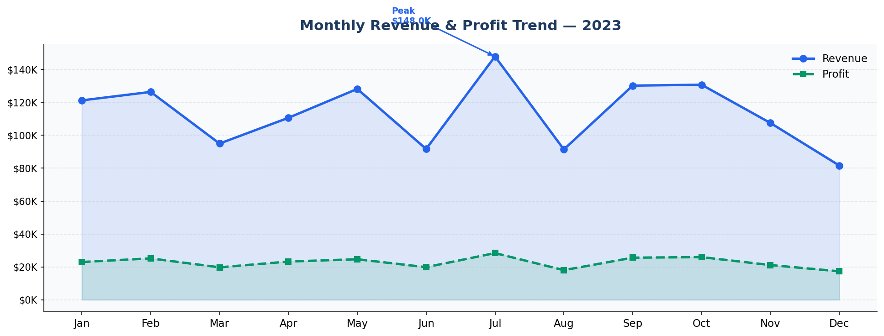
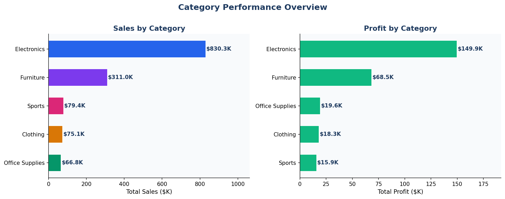
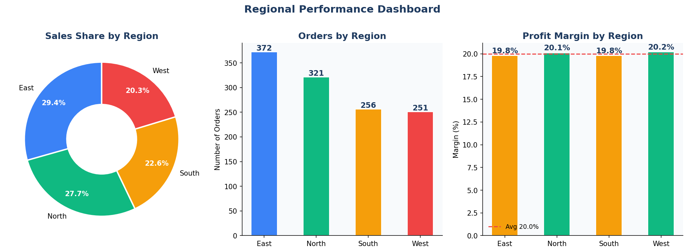
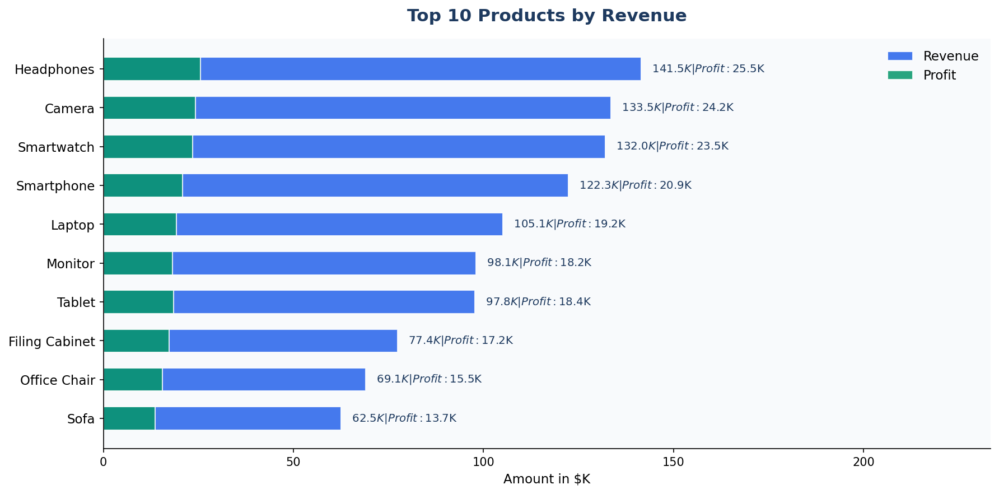
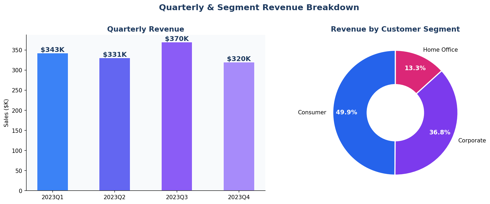
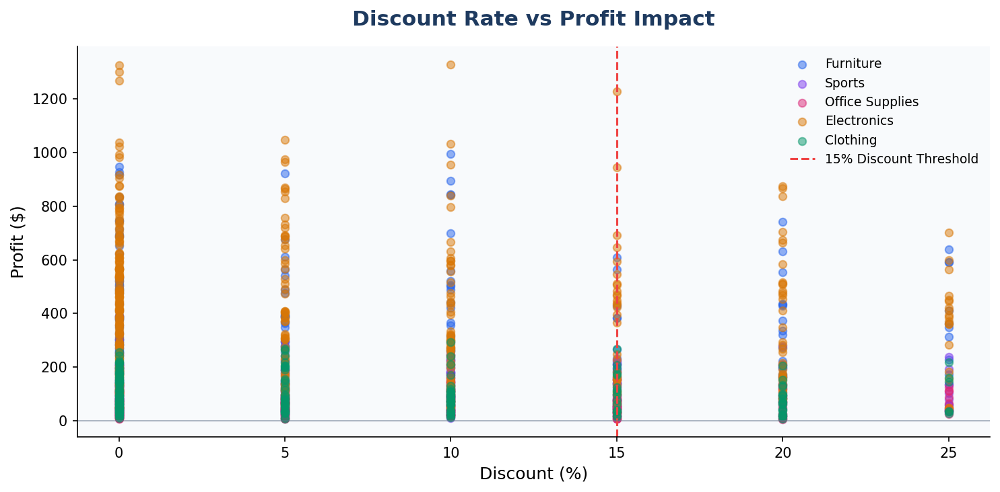

# 📊 FUTURE_DS_01 — Business Sales Performance Analytics

> **Future Interns | Data Science & Analytics Internship**  
> **Task 1 | Intern:** BADINA B S G SRI RAMCHARAN | **CIN:** FIT/MAR26/DS14341

---

## 🎯 Objective

Analyze business sales data to identify revenue trends, top-selling products, high-value categories, and regional performance — and deliver actionable business recommendations.

---

## 📁 Repository Structure

```
FUTURE_DS_01/
│
├── FUTURE_DS_01_Task1_Sales_Analytics.ipynb   ← Main Jupyter Notebook (full analysis)
├── sales_data.csv                              ← Dataset (1,200 orders, 2023)
├── chart1_monthly_trend.png                   ← Monthly Revenue & Profit Trend
├── chart2_category.png                        ← Category Performance
├── chart3_regional.png                        ← Regional Performance Dashboard
├── chart4_top_products.png                    ← Top 10 Products by Revenue
├── chart5_quarterly_segment.png               ← Quarterly & Segment Breakdown
├── chart6_discount_profit.png                 ← Discount vs Profit Impact
└── README.md
```

---

## 🛠️ Tools & Technologies

| Tool | Purpose |
|------|---------|
| Python 3 | Core programming language |
| Pandas | Data manipulation & analysis |
| NumPy | Numerical computations |
| Matplotlib | Data visualization |
| Jupyter Notebook | Interactive analysis environment |

---

## 📊 Key Findings

| Metric | Value |
|--------|-------|
| Total Revenue | $1,362,653 |
| Total Profit | $272,189 |
| Profit Margin | 20.0% |
| Total Orders | 1,200 |
| Average Order Value | $1,136 |
| Top Region | East |
| Top Category (Revenue) | Electronics |
| Top Category (Margin) | Office Supplies |

---

## 💡 Actionable Recommendations

1. **Double down on Electronics** — highest revenue category, boost marketing in peak months
2. **Leverage Office Supplies margin** — 30% margin; bundle deals can scale revenue
3. **Invest in the East region** — leads in orders and revenue
4. **Cap discounts at 15%** — data confirms discounts >15% erode profit significantly
5. **Target Corporate segment** — untapped B2B growth potential
6. **Seasonal campaigns in Q2–Q3** — peak revenue quarters
7. **Feature top 3 products** — Laptops, Smartphones, Office Chairs drive the most revenue

---

## 📸 Visualizations

### Monthly Revenue & Profit Trend


### Category Performance


### Regional Dashboard


### Top 10 Products


### Quarterly & Segment Breakdown


### Discount vs Profit Impact


---

## ▶️ How to Run

```bash
# Clone the repository
git clone https://github.com/YOUR_USERNAME/FUTURE_DS_01.git
cd FUTURE_DS_01

# Install dependencies
pip install pandas numpy matplotlib seaborn jupyter

# Launch the notebook
jupyter notebook FUTURE_DS_01_Task1_Sales_Analytics.ipynb
```

---

## 📬 Contact

**Intern:** BADINA B S G SRI RAMCHARAN  
**CIN:** FIT/MAR26/DS14341  
**Organization:** [Future Interns](https://www.linkedin.com/company/future-interns/)  
**Hashtag:** #futureinterns
